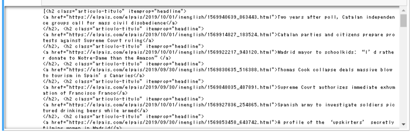

# News Scraper App using Python

News Scraper App using Python and Beautiful Soup and Flask to scrape the latest news articles from a live news site

<a href="https://pythonnewsscraper.herokuapp.com/">View Demo</a>

## About the Project


This single-page web app scrapes live news site of El Paris using Beautiful Soup then the scraped data will be filtered, cleaned and displayedin the list below on this site using Flask and deployed using heroku.

Built with:

- Python
- Beautiful Soup
- Flask with ninja

## Getting Started

Everytime my news scraper app website built with Flask gets loaded, the live news site El Paris English site (in the pic below) gets scraped with Python library Beautiful Soup.


```python
import requests
from bs4 import BeautifulSoup

r1 = requests.get("https://elpais.com/elpais/inenglish.html")
coverpage = r1.content

soup1 = BeautifulSoup(coverpage, 'html5lib')

coverpage_news = soup1.find_all('h2', class_='articulo-titulo')
```
the code above returns the raw data of all the news articles that is currently displayed on the site as follows:



From the data above, I cleaned the data and extracted the title and the link of each articles currently displayed, then I did the same for different section of the web to scrape the news category of each news article.

Then using Flask and ninja, I extract the data of the latest top 5 news articles and get them displayed on my news scraper app.


